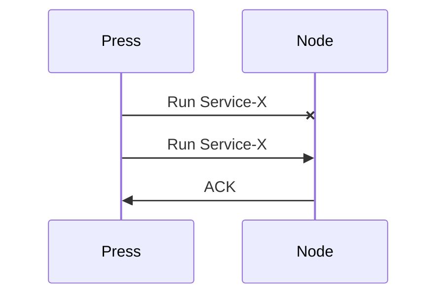
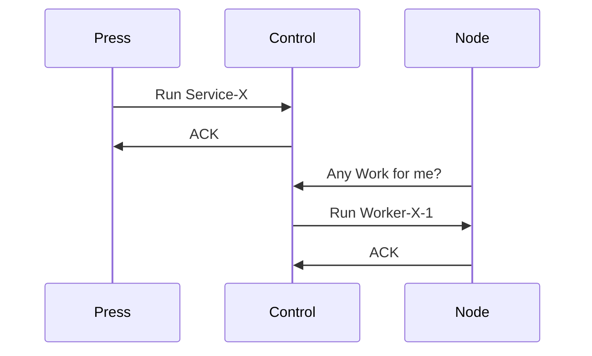

## Cluster Architecture
### Press
Currently Press is aware of all Nodes and expects them to be available and responsive at all times

In situations when the Nodes don't respond. We must the node back up and retry the request.

### Alternative - 1 

Press only needs to be aware of some Nodes. Let's call them Control Nodes.

Control Nodes acknowledge all Press requests and then 

This looks a lot like Nomad comms: You send jobs to the Servers and that's it, you don't talk to the Clients and don't need to be aware of them.

This means too many messages back and forth and multiple sources of truths?

But. We can keep only need to be aware of Control Nodes to say 3. With strong replication these can be made ephemeral. So failure to communicate with one of them isn't the end of the world.

Also local comms. e.g. Node-X has failed and rescheduling work to Node-Y doesn't need to involve Press.

With Global deployments Press <<->> Control comms have ~100ms latency. This seems way too high for fast comms.
Also global communications don't always work.

Too many times we've seen a region completely inaccessible to Press. Though this is inevitable. It ideally shouldn't affect normal operations (I want a Node failure to be treated as a normal operation. Shouldn't require our intervention)

---

# Kinds of Communication

## Provision
We've already taken this out of scope with OpenTofu

## Orchestration

Deploying Containers on Nodes

Some auxiliary work. Setting up Network, Volumes etc.

## Services?

Create/Migrate/Drop Sites
Transfer Volumes between Nodes