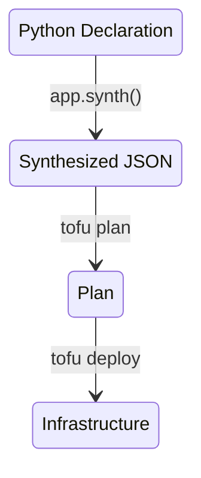

We want to do as much work in Python / JSON as possible

Luckily Tofu helps out.

Every plan / state can be stored as JSON or converted to JSON.

Here's the rough idea

Same thing in words

1. Write Python code in `TerraformStack.__init__()` that describes the infra we need
2. "Synthesize" this TerraformStack object `app.synth()`

The synth actually executes the `__init__` so we can do whatever we want in Python (loops, conditionals etc)

`synth` generates a `cdktf.out/stacks/<stack-name>/cdktf.json` file in the working directory (this is `frappe-bench/sites`)

We will use `sites/<site>/stacks` for now. So the state moves with the site without any special handling. 

TODO: Include this directory in the file backups.

3. Store this synthesized JSON in some DocType Provision

Note: Our Stack can have bugs or the code that defines what we need can have bugs. Have a way to prevent catastrophies at this stage. We need sanity checks in Production to guard against
- Don't trigger anything that can cause data loss
- Don't trigger massive changes ( More than n resources at a time)
- Cross stack changes ?! (Don't delete someone other region?!)
